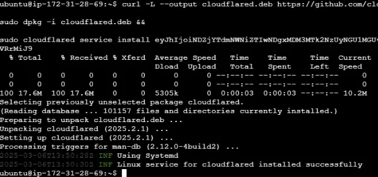
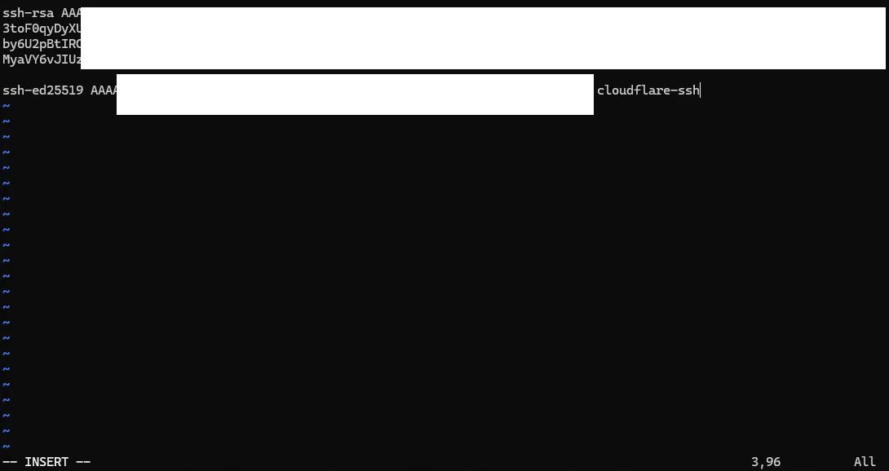

## สิ่งที่ต้องเตรียม
- cloudflare account
- cloudflare zero trust
- cloudflared
- domain ที่เชื่อมกับ cloudflare account ไว้แล้ว
- server เอาไว้รัน ssh server (ผมใช้ aws ec2)
- client (เครื่องที่เอาไว้ connect ไปที่ server)

## สร้าง Tunnel
ไปที่หน้าแรก https://dash.cloudflare.com/

ไป domain ที่ต้องการที่จะใช้ แล้วไปที่ Access -> Launch Zero Trust (หรือ https://one.dash.cloudflare.com/ )

สร้าง teamname (จะถูกเอาไปใช้ตอนยืนยันตัวตน) ถ้าสร้างแล้วให้เลือกที่สร้างไว้


ไปที่ Network -> Tunnels -> Add a tunnel


Select Cloudflared


ตั้งชื่อ tunnel


เลือก Env


แล้วทำตาม Step ที่ web บอก อย่างของผมเป็น ubuntu 24.04 ก็เลือก Debian 64-bit แล้วคัดลอกอันแรกไปวางเพราะไม่เลยลง cloudflared ในเครื่อง server



กด Next

ตั้ง Route Tunnel ตามนี้ได้เลย


ถ้าทุกอย่างปกติ พอเข้าไป sub domain ที่ตั้งควรหน้าจอขาวแบบนี้


## กำหนด Access (สิทธิ์การเข้าถึง)
https://one.dash.cloudflare.com/ -> Access

### สร้าง Policies
สร้าง Policies เพื่อกำหนดว่าอนุญาติให้ใครเข้าใช้งานได้บ้าง

**Access -> Policies -> Add a policy**


ตั้งชื่อ Policies และ กำหนด rule แล้วกด next


### สร้าง Application
ไปที่ Access -> Applications -> Add an applications


เลือก Self-hosted


ตั้งชื่อ Applications แล้วเลือก select existing policies ที่เราสร้างไว้ แล้วกด next


**Experience settings (optional)** กับ **Advanced settings (optional)** ถ้าอยากตั้งก็ตั้งได้เลยครับ ผมขอยาด next next เลย

## Setup cloudflared บนเครื่อง (client)

### install cloudflared
```powershell
winget install --id Cloudflare.cloudflared
```

ใช้ os อื่น อ่านเพิ่มเติมที่ https://developers.cloudflare.com/cloudflare-one/connections/connect-networks/downloads/


— source winget เพราะ ผม test บน sandbox

### Generate Ed25519 Certificate
```bash
ssh-keygen -t ed25519 -C "cloudflare-ssh"
```


ชื่อไฟล์ หรือ comments ตั้งตามที่ต้องการได้เลย
คัดลอก public key จาก ไฟล์ที่สร้าง ไปไว้ที่ server

```bash
cat ./keyuwu.pub
vim ./.ssh/authorized_keys
```


ไฟลอยู่ที่ ./.ssh/authorized_keys สำหรับ aws ที่อื่น idk lol
save แล้วลอง test ssh ไปดู ด้วย

```bash
ssh -i .\keyuwu -o "ProxyCommand=C:\Program Files (x86)\cloudflared\cloudflared.exe access ssh --hostname %h" ubuntu@ssh.c0ffeeoverdose.xyz
```

- `-i` คือตำแหน่งที่ private key อยู่
- `-o` คือตำแหน่งที่ cloudflared อยู่
- `ubuntu@ssh.c0ffeeoverdose.xyz` ubuntu คือ username เครื่อง ssh.c0ffeeoverdose.xyz คือ sub domain ที่เราตั้ง

พอเรารัน แล้วเราจะมา auth ตามนี้


ให้ใส่ gmail ที่เราอนุญาติลงไป แล้วกด Send me a code
แล้วเอา otp มาใส่ (ถ้าไม่ถูกส่งให้กด Resend email)


ถ้าติด **That account does not have access.** แล้วมั่นใจว่าตั้งถูกแล้ว อาจต้องรอซักพัก ประมาณ 15 นาที ไม่รู้ว่ามันบัคอะไร ;-;

## Config ssh
config ssh เพื่อให้เข้าได้สะดวกมากขึ้น

```powershell
@'
Host ssh.c0ffeeoverdose.xyz
    User ubuntu
    IdentityFile  C:/Users/WDAGUtilityAccount/cer/keyuwu
    ProxyCommand "C:/Program Files (x86)/cloudflared/cloudflared.exe" access ssh --hostname %h
'@ | Out-File -Encoding utf8 -FilePath $HOME/.ssh/config
```

```bash
ssh ssh.c0ffeeoverdose.xyz
```

จบ! blog นี้เหมือนเขียนให้ตัวเองนั้นแหละ ชอบลืมวิธี แล้วต้องไล่อ่าน docs ทุกรอบ ;-;