# SECPlayground Hackloween CTF 2024 Write-up

ใน event นี้ มีคนในทีม solve จริงๆ 2 คน เวลาแข่ง 24h noonomyen อยู่จนเกือบจบการแข่ง ส่วนผมหลับเวลาปกติ แต่เล่นตื่นทุกๆ 1–2 ชั่วโมงเฉย แล้วหลับต่อ ตื่นมาใจเต้นเร็วชิบหาย หรือผมจะตกหลุมรักโจทย์ไปซะแล้ว นอนไปในหัวมีแค่โจทย์ lol ah ok นอกเรื่องมาไกลละ มาเริ่มกันเลย

## โจทย์ทั้งหมด

### Web Application Security
- Fast Input (Team Solved)
- Please find the secrets (Team Solved)
- Enter Captcha (Solved)

### Reverse Engineering
- App.jar (Team Solved)
- reverseme.exe (Team Solved)

### Network Analysis
- Set-Password (Team Solved)
- Reverse Reverse Reverse
- File Transfer (Solved)
- I Can See You#1 (Team Solved)
- I Can See You#2 (Team Solved)
- I Can See You#3 (Team Solved)
- I Can See You#4 (Solved)
- I Can See You#5 (Team Solved)
- I Can See You#6 (Solved)

### Incident
- My legacy application was hacked#1 (Team Solved)
- My legacy application was hacked#2 (Solved)
- My legacy application was hacked#3 (Solved)
- My legacy application was hacked#4
- My legacy application was hacked#5
- My legacy application was hacked#6
- My legacy application was hacked#7

### Artificial Intelligence
- AI Prompt Injection#1 (Team Solved)
- AI Prompt Injection#2 (Team Solved)
- AI Prompt Injection#3
- AI Prompt Injection#4

### Cryptograph
- Can You Tell Me the Secret (Solved)
- Stand By Me (Team Solved)

### Log Analysis
- Following the Leak Trail #1 (Team Solved)
- Following the Leak Trail #2 (Team Solved)
- Following the Leak Trail #3 (Team Solved)

---

## Web Application Security

### Enter Captcha


สิ่งที่ทำอย่างแรก เข้าไปที่ website ที่เขาให้มา จะได้หน้าให้ใส่ Captcha

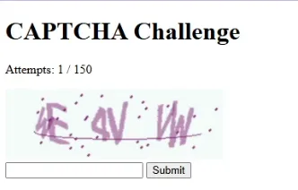
แล้วเราลองกด View Page Source ดูเราจะได้

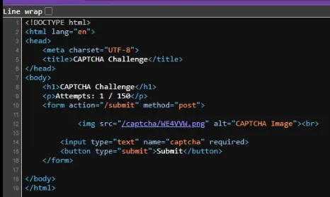
จะสังเกตได้ว่า ชื่อไฟล์ มันเป็นข้อความที่ปรากฏในภาพ ซึ่งสิ่งที่เราต้องทำคือดึงเอา ข้อความนั้นมาใส่ใน Captcha ซึ่งสามารถใช้ python code นี้ได้เลย >-<

```python
import requests
import re
import time

url = "http://35.198.221.25/"
session = requests.Session()

for i in range(150):
    response = session.get(url)
    captchaMatch = re.search(r'src="/captcha/(.*?).png"', response.text)
    if captchaMatch:
        captcha = captchaMatch.group(1)
        headers = {
                "Content-Type": "application/x-www-form-urlencoded",
                "Origin": url,
                "User-Agent": "Mozilla/5.0 (Windows NT 10.0; Win64; x64) AppleWebKit/537.36 (KHTML, like Gecko) Chrome/130.0.6723.70 Safari/537.36",
                "Referer": url
        }
        data = { "captcha": captcha }
        response = session.post(url + "submit", headers=headers, data=data)
        print(f"Iteration {i + 1}")
        print("Extracted CAPTCHA code: " + captcha)
        print("Response status code: " + str(response.status_code))
        print("Response text: " + response.text)
    else:
        print("CAPTCHA not found")

    time.sleep(1)
```

เราจะได้ Flag มาตามนี้

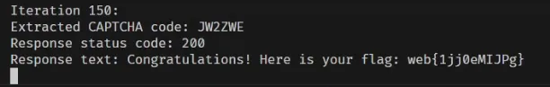
`web{1jj0eMIJPg}`

---

## Network Analysis

### File Transfer

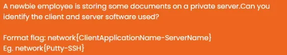
ข้อนี้เราจะได้ไฟล์ `file_transfer.pcapng` มาให้เปิดด้วย Wireshark แล้ว filter ด้วย

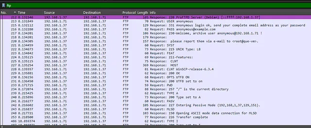
`ftp` แล้ว TCP Stream
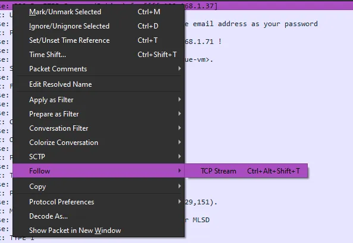
จะได้ข้อมูลตามนี้

```
220 ProFTPD Server (Debian) [::ffff:192.168.1.37]

USER anonymous

331 Anonymous login ok, send your complete email address as your password

PASS anonymous@example.com

230-Welcome, archive user anonymous@192.168.1.71 !

 The local time is: Thu Jul 11 14:59:31 2024

 This is an experimental FTP server.  If you have any unusual problems,
 please report them via e-mail to <root@que-vm>.

230 Anonymous access granted, restrictions apply

SYST

215 UNIX Type: L8

FEAT

211-Features:
 CLNT
 EPRT
 EPSV
 HOST
 LANG en-US.UTF-8*;en-US
 MDTM
 MFF modify;UNIX.group;UNIX.mode;
 MFMT
 MLST modify*;perm*;size*;type*;unique*;UNIX.group*;UNIX.groupname*;UNIX.mode*;UNIX.owner*;UNIX.ownername*;
 RANG STREAM
 REST STREAM
 SITE COPY
 SITE MKDIR
 SITE RMDIR
 SITE SYMLINK
 SITE UTIME
 SIZE
 TVFS
 UTF8
211 End

CLNT WinSCP-release-6.3.4

200 OK

OPTS UTF8 ON

200 UTF8 set to on

PWD

257 "/" is the current directory

TYPE A

200 Type set to A

PASV

227 Entering Passive Mode (192,168,1,37,129,151).

MLSD

150 Opening ASCII mode data connection for MLSD
226 Transfer complete

TYPE I

200 Type set to I

PASV

227 Entering Passive Mode (192,168,1,37,129,135).

RETR flag.txt

150 Opening BINARY mode data connection for flag.txt (24 bytes)
226 Transfer complete
```

เราจะเห็น `CLNT WinSCP-release-6.3.4` และ Server คือ `ProFTPD Server` เอาไปตอบตาม Flag format
`network{WinSCP-ProFTPD}`

### I Can See You#4

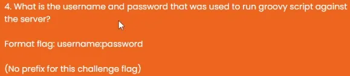
ข้อนี้เราจะใช้ NetworkMiner แต่เนื่องจากไฟล์ที่เขาให้มาคือ pcapng จึงต้องเอาแปลงเป็น pcap ก่อน

```bash
tshark -F pcap -r ./I_CanCU.pcapng -w ./I_CanCU.pcap
```

พอเราโยนไฟล์ pcap ให้ NetworkMiner แล้วไปที่ Credentials แล้วเราจะเห็น Username admin Password admin อืมนั้นแหละ

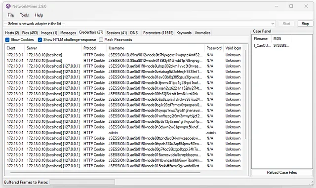
`admin:admin`

### I Can See You#6


ใช้ `strings` และ `grep`:

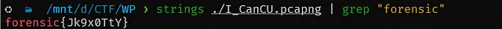
อืม นั้นแหละ
```bash
strings ./I_CanCU.pcapng | grep "forensic"
```

อืม นั้นแหละ
`forensic{Jk9x0TtY}`

---

## Incident

### My legacy application was hacked#2

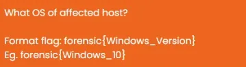
แตกไฟล์ แล้วเปิด `My_legacy_application\ModuleResult\LiveResponsemsinfo.txt`
เจอ OS Name:

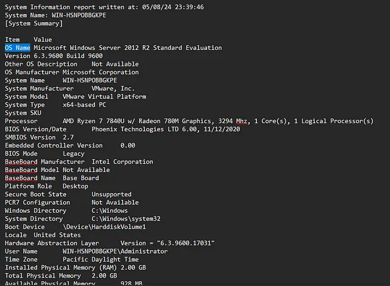

เอาไปใส่ใน flag format
`forensic{Windows_Server_2012_R2}`

### My legacy application was hacked#3

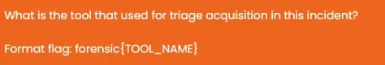
เปิดไฟล์ `My_legacy_application\ModuleResult\2024–05–09T062440_ConsoleLog.txt`

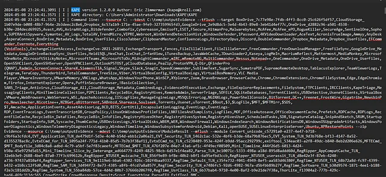
เราจะเห็นว่ามันคือ KAPE เอาไปตอบใน flag format
`forensic{KAPE}`

---

## Cryptograph

### Can You Tell Me the Secret


ข้อนี้เราจะได้ไฟล์ภาพมา 1 ภาพ

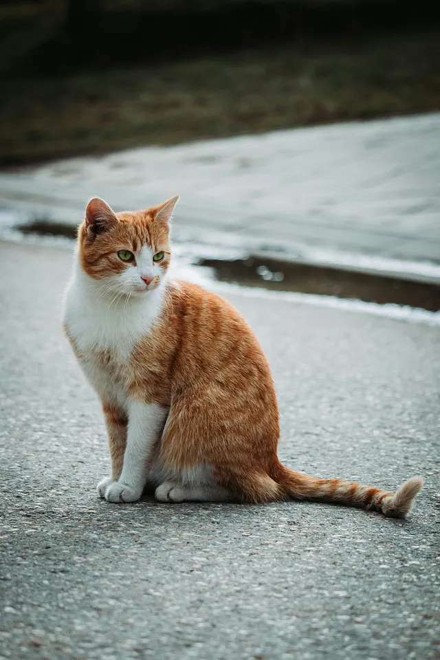
ใช้ `exiftool` ดู metadata

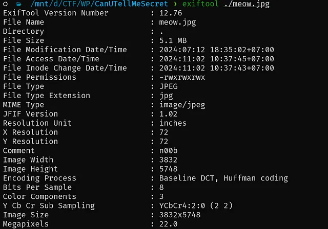
เราจะเห็นว่ามี Comment ว่า n00b
ใช้ steghide info เพื่อเช็คว่ามีอะไรข้างในไหม โดยที่ใช้ n00b เป็น passphrase

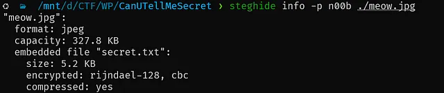
```bash
steghide extract -p n00b -sf meow.jpg
```

เราก็จะเจอว่ามี secret.txt
เราจึงใช้ steghide extract

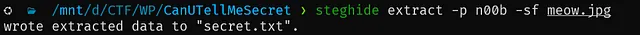

แล้วเราจึงเปิดไฟล์ secret.txt แล้วจะได้ข้อความที่เป็น base64 มา เราจึงเอาไปปาลง [CyberChef](https://gchq.github.io/CyberChef/) แล้ว From Base64 และต่อด้วย From Hex

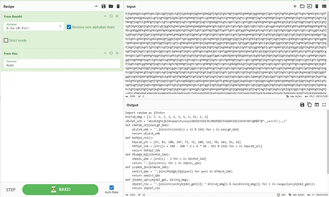
เราจะได้ python code มา ที่อ่านยากชิบหาย ;-; เลยโยนให้ ChatGPT แก้ Chat ช่วยด้วยยยยยย แล้ว Chat ก็ให้ Flag มาตามนี้

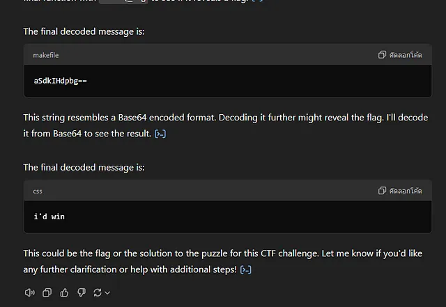
เอาก็เอาไปใส่ใน Flag Format แล้วตอบ
`crypt{aSdkIHdpbg==}`

---

ครบบบบบ ที่เหลือไปอ่านที่ write up ของ [noonomyen](https://blog.noonomyen.com/posts/ctf/secplayground-hackloween-ctf-2024-writeup/) นะครับ

---

## ท้ายนี้ขอบ่นอะไรหน่อยเถอะ

ข้อ My legacy application was hacked#4 อะไรคือการที่ต้องใส่ `\\` ตลกมากแหละ แหมมมมมมมมม
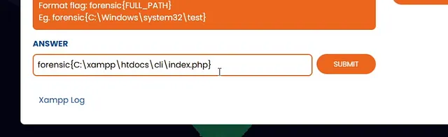
และดู Eg. และ Hint แหมมมมมมมมม ตั้งใจปั่นผู้เข้าแข่งขันแหละดูออก
แต่ไปหาปั่นอะไรข้อที่ถ้าทำไม่ได้ อีก 3 ข้อที่เหลือก็ไม่สามารถเข้าไปทำได้ ตลก ขำ 😭😭😭
ว่าแต่ ตอนนี้เป็นไงบ้างละข้อง่ายแต่คนทำได้แค่ 6 ทีม emotional damage เลยไหมละ😏😏😏