# SWU Capture the Flag Competition 2025 Writeup (Round 1)
งานแข่งนี้ผมสมัครเพราะเวลาแข่งมันใกล้มาก ผมไม่ได้แข่ง CTF นานแล้ว เลยถือว่าเป็นการวอร์มอัพ ชิวๆ เพราะในประกาศรับสมัคร ผมไม่เห็นว่ามีเงินรางวัล เลยคิดว่าเป็นงานที่ชิวๆ
คนตึงๆ ไม่น่ามากันหรอกมั่ง แต่พออ่านรายละเอียดในกลุ่ม Line และ ดูชื่อทีม ชื่อมหาวิทยาลัย แต่ละคน ahhhhhh "That time, I knew it — I fucked up." แต่ละคนตึงๆ ทั้งนั้น :< มีวงในกันเหรอ wa เลยรู้ว่างานนี้มีเงินรางวัล หรือแค่ว่างกันเฉยๆ
เอาละเกริ่นนำซะนาน มาเริ่มกันเถอะ
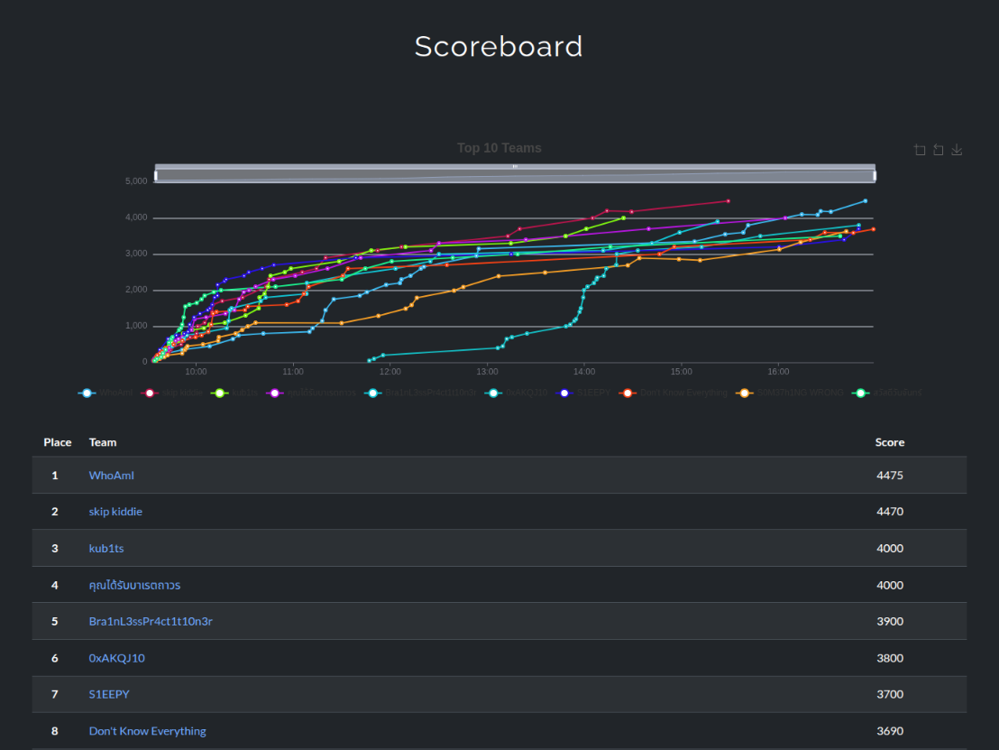

## โจทย์ทั้งหมดที่ผม solve ได้

### ~~Binary Exploitation (Pwn)~~

### Cryptography
- Agent 172

### Forensics
- Slack Space
- Dear Brute…

### Miscellaneous
- Game of Colors
- u-i-i-io-i-ii-a-io

### ~~Mobile Application~~

### Network
- อดทนจนกว่าจะได้ flag

### Web Application
- Find me!
- Break In and Find the Secrets

## Agent 172
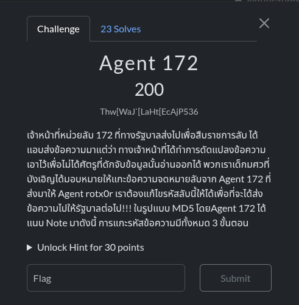

เราได้ข้อความแปลกๆ มา
```
Thw[WaJ`[LaHt[EcAjP536
```
โยนเข้า [CyberChef](https://gchq.github.io/CyberChef/) แล้วโยน magic เข้าไป และเปิด Intensive Mode
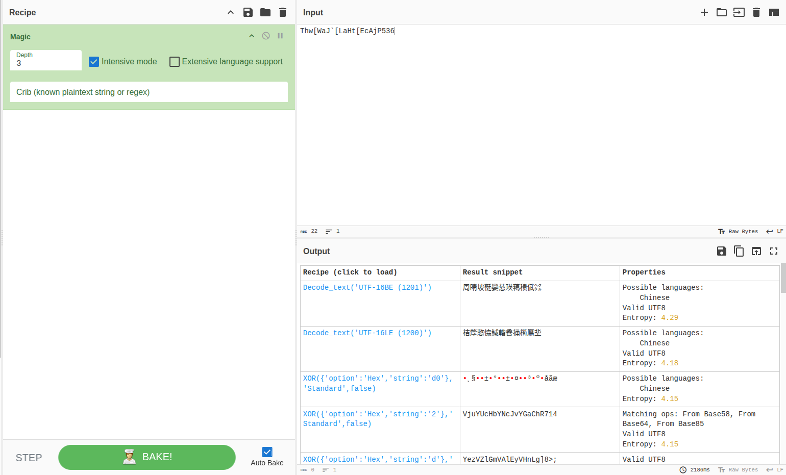

เลื่อนๆ ไปเราก็เจอกับ
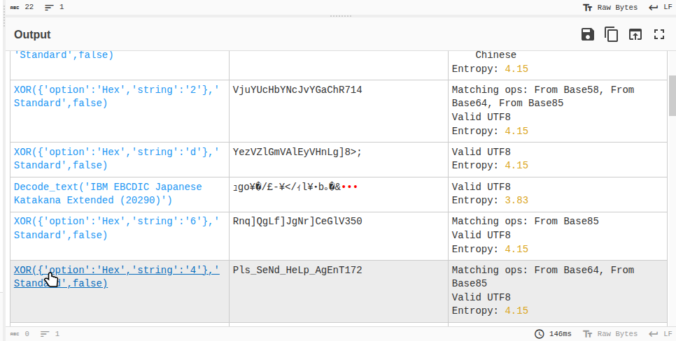

แต่โจทย์บอกว่าใช้ MD5 เพราะงั้นโยน MD5 ไปเพิ่ม
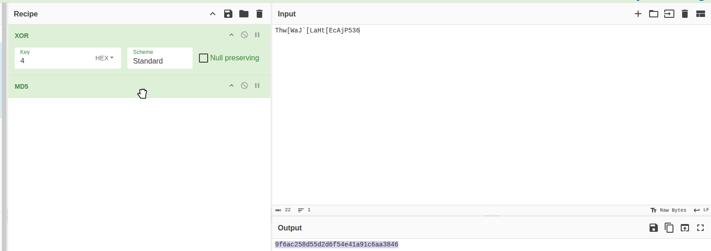

```
swu{9f6ac258d55d2d6f54e41a91c6aa3846}
```

## Slack Space
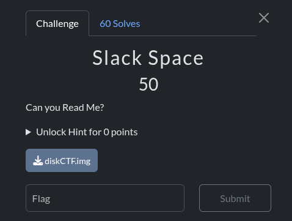

เราได้ไฟล์ diskCTF.img มา
ลอง cat ออกมา ได้ประโยคบางอย่างมา ลอง find flag format
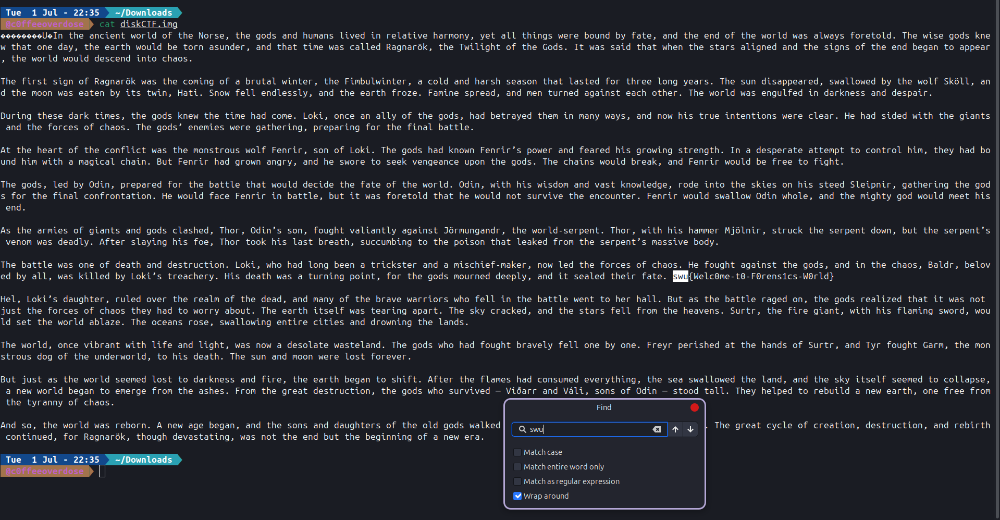

```
swu{Welc0me-t0-F0rens1cs-W0rld}
```

## Dear Brute…
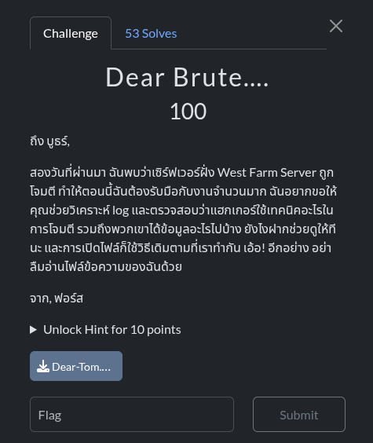

เราได้ไฟล์ Dear-Tom.zip มา ลอง unzip ออกมา
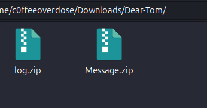

เราจะได้ไฟล์ log.zip ที่ติด password กับ Message.zip ที่ไม่มี password
แตกไฟล์ Message.zip จะได้ secret.txt ที่เป็น wordlist
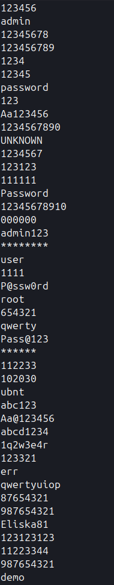

ใช้ fcrackzip brute-force
```
fcrackzip -v -D -p ./secret.txt ./../log.zip
```

ได้ password มาแล้ว
```
P@$$w0rd
```
เอาไป unzip และเราจะได้ auth.log เราจึงลอง cat ดูว่ามันคืออะไร
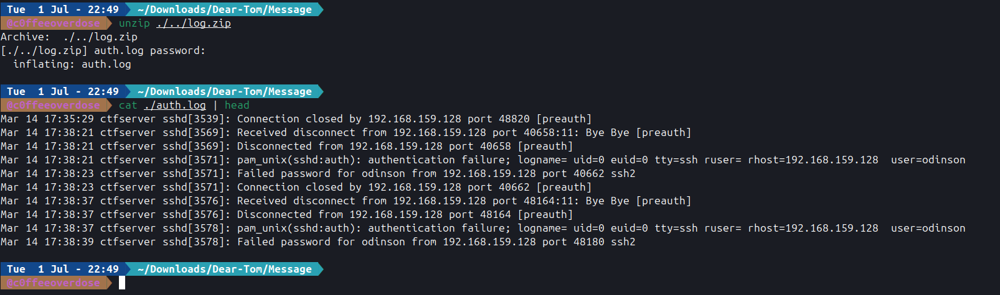

จะเห็นว่ามันคือ log อะไรบางอย่าง โจทย๋บอกว่า `รวมถึงพวกเขาได้ข้อมูลอะไรไปบ้าง` ผมจึงลอง grep "swu{" ที่เป็น flag format ดู
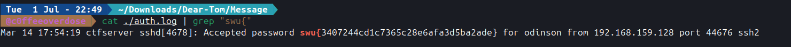

หะ? log บ้าอะไรเก็บ password wtf<br>
ช่างมันละกัน
```
swu{3407244cd1c7365c28e6afa3d5ba2ade}
```

## Game of Colors
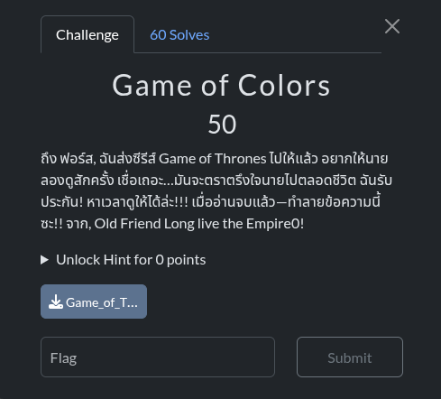

เราได้ไฟล์ Game_of_Thrones.pdf
ลอง Ctrl A ดู
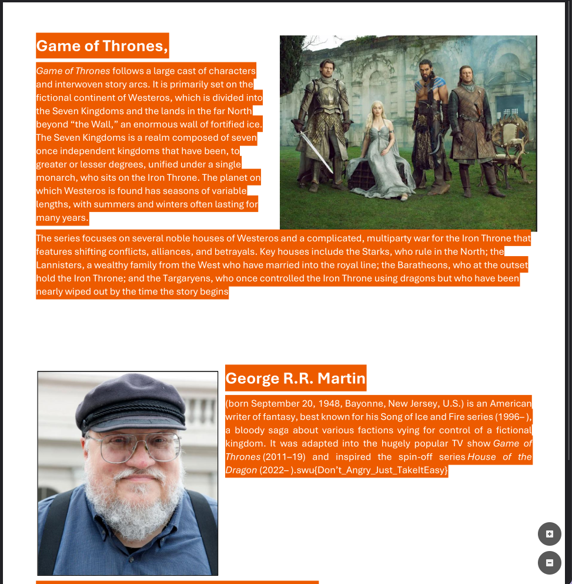

Um Classic
```
swu{Don’t_Angry_Just_TakeItEasy}
```

## u-i-i-io-i-ii-a-io
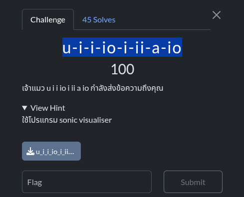
เราได้ไฟล์ u_i_i_io_i_ii_a_io.wav ที่เป็นเสียงแมวอุอิอา เสียงเร็ว ช้าสลับกัน เสียงสูงให้เป็น... ไม่เกี่ยว! ;-; (ข้อนี้ต้องเปิด hint เพราะมัวแต่อยู่กับจังหวะเสียง :<)
เพราะสิ่งเราต้องทำจริงคือใช้ [Sonic Visualiser](https://www.sonicvisualiser.org/)

Add Waveform กับ Spectrogram
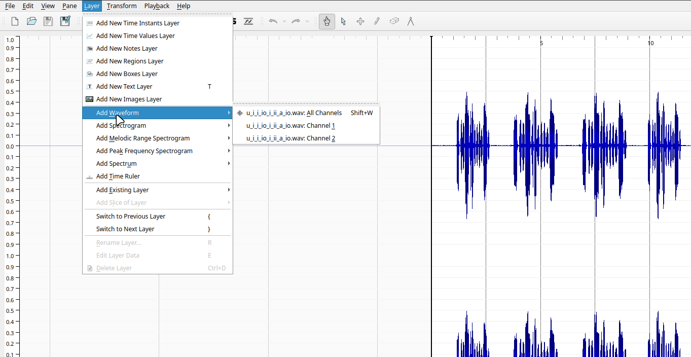
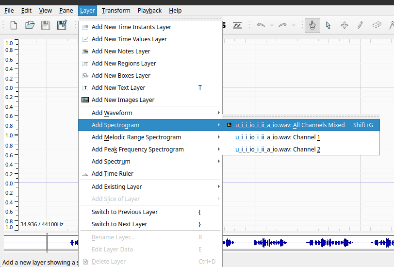

แล้ว zoom ไปด้านล่าง เราจะเห็น flag 
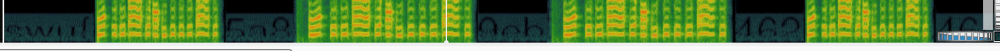

```
swu{5a89eb46246eb29f3d494c3f05b4db21}
```

## อดทนจนกว่าจะได้ flag
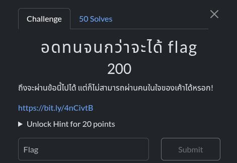

เราได้ไฟล์ Network_Medium.pcapng มา ให้เปิดด้วย wireshark แล้วไปที่ File -> Export Objects -> HTTP


save all ที่โฟลเดอร์ที่เราต้องการ
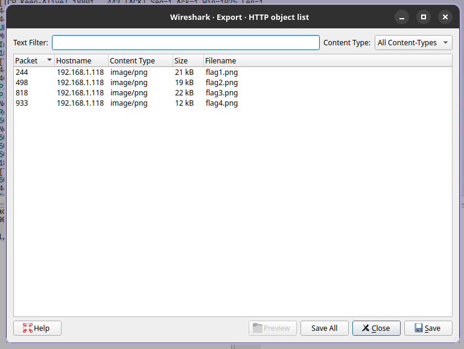


เราจะได้ไฟล์ png ที่ดูยังไงก็ base64 ที่แยกกันอยู่ ให้เราแคปรูปแล้วโยนเข้า [Search any image with Lens](https://www.google.com/)
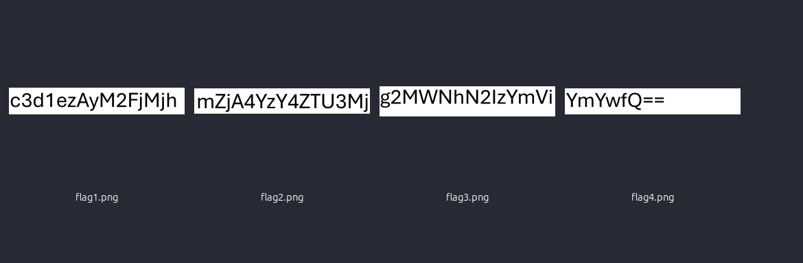
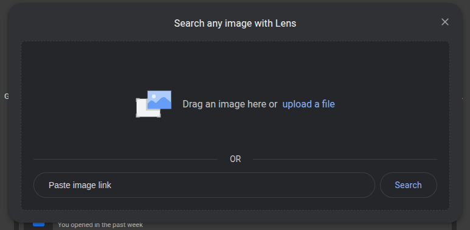

ก๊อปข้อความ
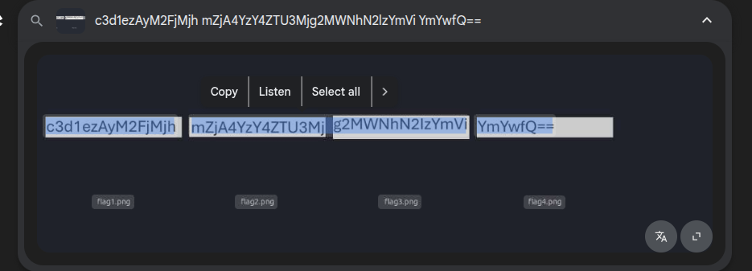

แล้วโยนเข้า [CyberChef](https://gchq.github.io/CyberChef/) โดยใส่ From Base64
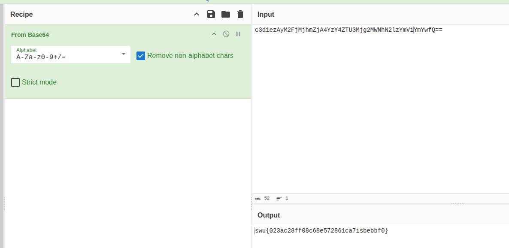

```
swu{023ac28ff08c68e572861ca7b3bebbf0}
```

## Find me!
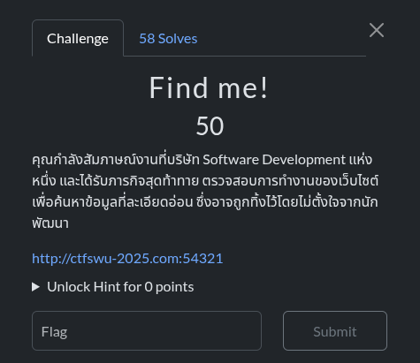

เราได้เว็บหนึ่งมา ลองเข้าไป
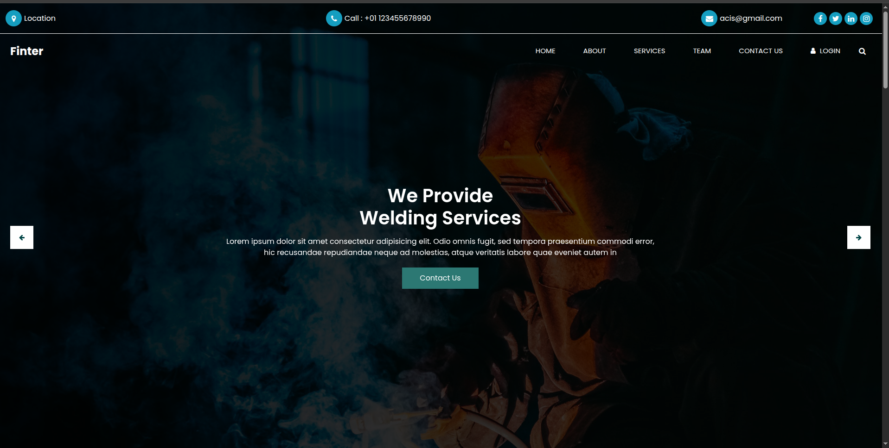

ลอง view-source ดู `view-source:http://ctfswu-2025.com:54321/` และ find `swu` ดู
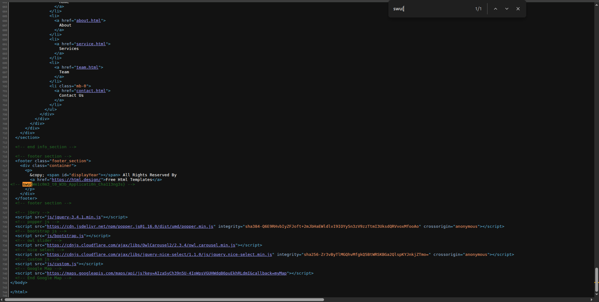

Um Classic~
```
swu{We1c0m3_t0_W3b_Applicati0n_Cha113ng3s}
```

## Break In and Find the Secrets
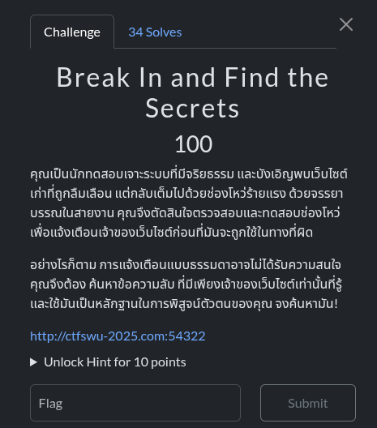

เราได้เว็บหนึ่งมา


ลอง view-source ดู
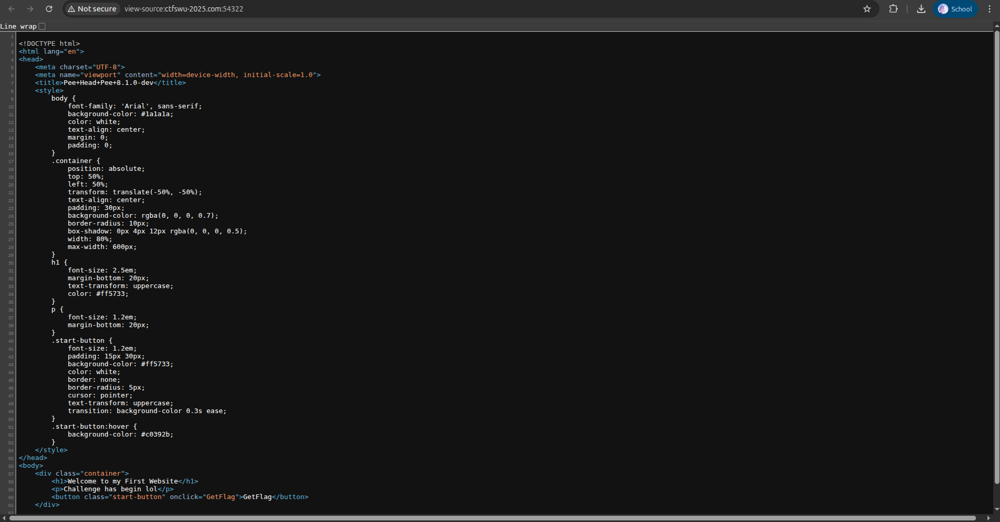

เราจะเห็น title เขียนไว้ว่า 8.1.0-dev ลองเอาไป search
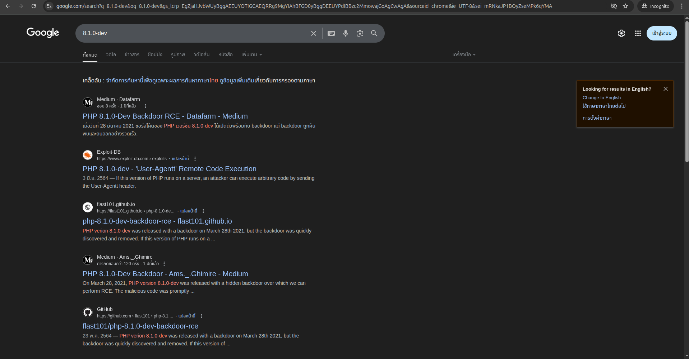

จะเจอว่า ใน php version 8.1.0-dev มี backdoor ที่สามารถ RCE ได้
เราจึงลองบ้าง ด้วย [burp suite](https://portswigger.net/burp/)

Proxy -> เปิด Intercept และ Open browser แล้วเข้าเว็บ แล้วคลิ๊กขวาที่ Request ที่โผล่มา แล้ว Send to Repeater แล้วปิด Intercept
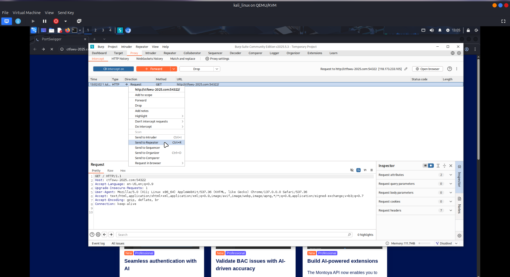

ไปที่ Tab Repeater แล้วเพิ่ม `User-Agentt: zerodiumsystem(“id”);` เหมือนใน writeup คนอื่น
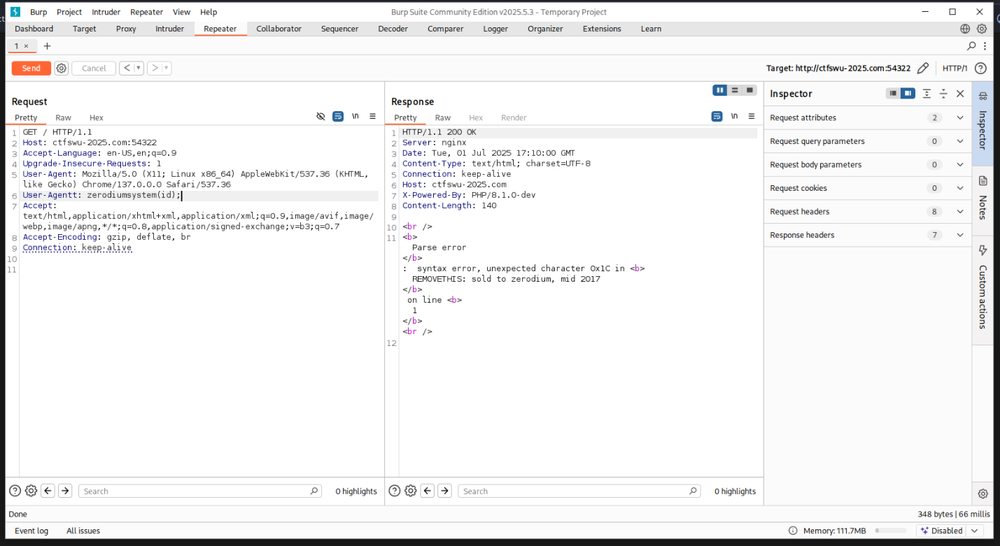

อ่าวได้ไง โดนเกียน 😭😭😭
ลองอะไรแปลกๆ อย่างการใช้ `User-Agentt: zerodiumsystem($_GET["cmd"]);` กับ `?cmd=ls` แทน
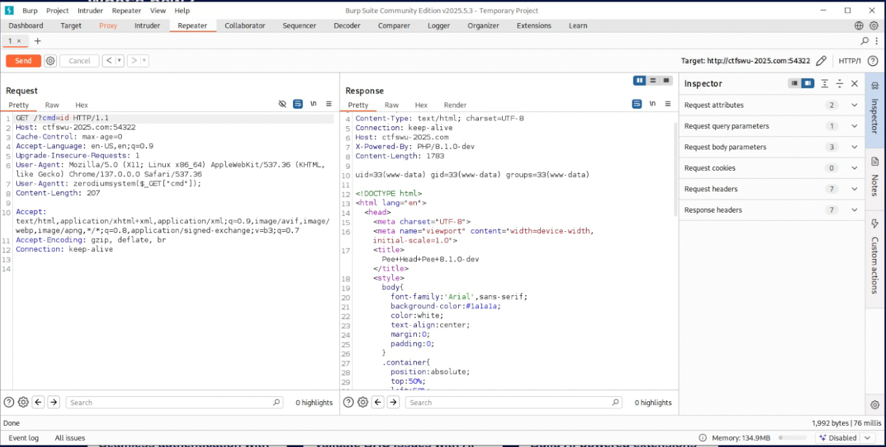

work ได้ไงวะนั้น<br>
nvm ทำต่อให้เสร็จ
ด้วยการ ls เรื่อยๆ จนกว่าหาที่ flag อยู่เจอ (encode url ด้วย [CyberChef](https://gchq.github.io/CyberChef/))<br>
ถ้าเจอแล้วให้ cat ออกมา 
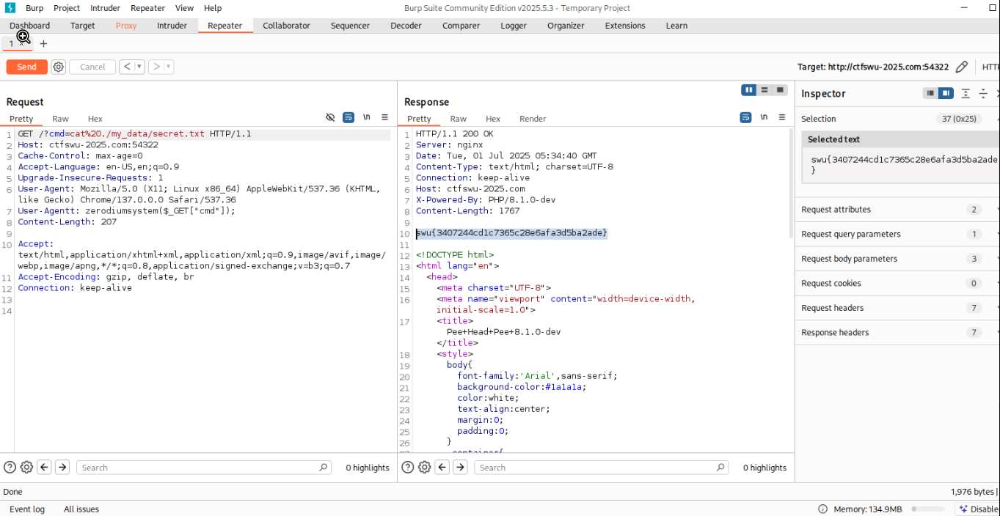
```
swu{3407244cd1c7365c28e6afa3d5ba2ade}
```

## บ่นท้าย writeup
จบบบบ ที่เหลือไปอ่านที่ write up ของ [noonomyen](https://blog.noonomyen.com) นะครับ

และก็เป็นอีกงานที่ข้อ upload ไฟล์ผมทำไม่ได้ ;-; มันทำยังไงกันแน่ wa

แข่งรอบที่ 2 ดันทับกับอีกงาน ;-; เอาละ คงต้องใช้วิชาแยกประสาทขั้นเทพ :> แต่ยังไงงานนี้ก็คงไม่น่าหวังเงินรางวัลได้ตัวตึงวงการเต็มไปหมด :< แต่ก็โชคดีที่งานนี้ online ทั้ง 2 รอบ เพราะถ้าเป็น onsite คงเล่นไม่ได้เลย ผมแยกร่างไม่ได้ละนะ~
ว่าแต่มันจะมี moment ที่ทำโจทย์อีกงานแล้วทีมงานมาถามว่าทำข้อไหนอยู่ครับ แล้วผมตอบว่าแบบ "อ๋อกำลังทำโจทย์อีกงานอยู่ครับ" คงดูแปลกๆ ดีแฮะ ไม่ว่าในทางดีหรือแย่